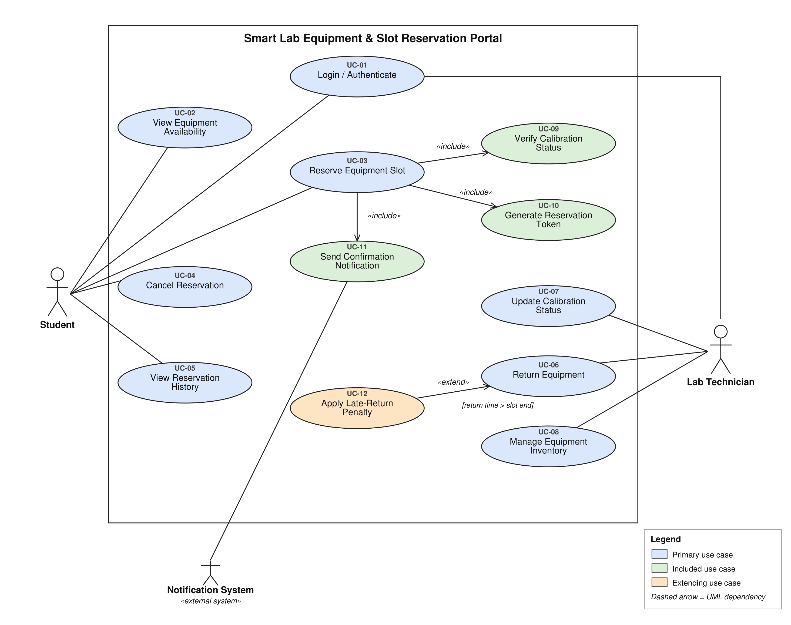

# Software Requirements Specification (SRS)

**Smart Lab Equipment & Slot Reservation Portal**

| | |
|---|---|
| Document ID | SRS-SLP-01 |
| Version | 1.0 (Mini-Project Part-1) |
| Author | Anagha N (PES1UG24CS058), PES University – Dept. of CSE |
| Format | Organised after the IEEE 830 SRS outline, as requested by the assignment (an IEEE-style structure; no formal standards-compliance is claimed) |
| Baseline inputs | `Requirements_Table.docx` (FR-001…FR-005, NFR-001, NFR-002), `UseCase_Flow_Specification.docx` (UC-03), `UML_UseCase_Diagram.pdf` (Lab 1) |
| Related documents | Test Plan (`Test_Plan.md`), Architecture & Design (`Software_Architecture_and_Design.md`), Traceability (`traceability/Requirements_Traceability.md`), Gap Analysis (`Gap_Analysis.md`) |
| Revision history | 1.0 – first complete Part-1 issue; audited against the assignment and the Lab 1 baseline (see `Gap_Analysis.md` §5) |

**How to read the requirement IDs.** FR-001…FR-005, NFR-001 and NFR-002 are the Lab 1 requirements and keep their original IDs and intent. Requirements marked **[NEW]** were added in Part-1 only where the Lab 1 use-case diagram or use-case flow contains behaviour that had no requirement; each one names its Lab 1 source in the *Basis* column. Items marked **[REFINED]** keep the Lab 1 intent but were reworded to be unambiguous and testable. Security requirements marked *Proposed* are not in Lab 1 and are justified in §4. Assumptions are tracked as **A-xx** in §2.6.

## 1. Introduction

### 1.1 Purpose
This document specifies the functional, non-functional and security requirements of the Smart Lab Equipment & Slot Reservation Portal. It is the reference for design (Software Architecture & Design Specification) and verification (Test Plan). Intended readers: the course evaluators, the developer (author) and future testers.

### 1.2 Scope
The portal manages time-slot reservations of calibrated laboratory equipment (for example oscilloscopes, logic analyzers and FPGA development boards). It lets **students** view availability, reserve, cancel and review reservations; lets **lab technicians** record equipment returns, maintain calibration status and manage the equipment inventory; blocks reservations of equipment whose calibration is not valid; prevents double-booking; and flags late returns.

Out of scope: user-account registration and provisioning (users are assumed to be already registered, see A-11), billing, procurement, any penalty beyond the late-return flag, and hardware integration with the instruments themselves.

### 1.3 Definitions, Acronyms and Abbreviations

| Term | Meaning |
|---|---|
| Student | A registered student who reserves equipment (primary actor). |
| Lab Technician | Lab staff who manage inventory, calibration status and returns (primary actor). |
| Notification System | External system that delivers email / notifications to students (secondary actor). |
| Equipment | A single reservable lab instrument record (name, category, calibration status, calibration due date). |
| Slot | A continuous time window reserved on one piece of equipment. |
| Reservation | A record binding a student, one equipment item and a slot; states: Confirmed, Cancelled, Returned. |
| Reservation Token | Unique identifier generated for a confirmed reservation and bound to student, equipment and slot. |
| Calibration Status | One of **Valid**, **Expired**, **Pending**. Only *Valid* equipment can be reserved (A-02). |
| Late-Return Penalty Flag | Boolean on a reservation, set when the return time is after the slot end time. |
| RBAC | Role-based access control. |
| FR / NFR | Functional / Non-Functional Requirement. |
| SEC-OBJ / SEC-REQ | Security Objective / Security Requirement. |
| UC | Use Case. |

### 1.4 References
1. `Requirements_Table.docx` – Lab 1 requirements table (FR-001…FR-005, NFR-001, NFR-002).
2. `UseCase_Flow_Specification.docx` – Lab 1 flow specification of UC-03 Reserve Equipment Slot.
3. `UML_UseCase_Diagram.pdf` – Lab 1 use-case diagram.
4. *Lab 1 Problem Statement #01* – Smart Lab Equipment & Slot Reservation Portal (PES University).
5. IEEE Std 830-1998, *Recommended Practice for Software Requirements Specifications*; ISO/IEC/IEEE 29148:2018.
6. *Software Engineering Mini-Project Deliverables Part-1* – assignment specification.

### 1.5 Overview
§2 describes the product and its context. §3 lists the specific requirements (functional, non-functional, interfaces). §4 contains the security objectives and requirements. §5 contains the use-case model with the UML use-case diagram and use-case descriptions. §6 gives the traceability summary. Detailed cross-document traceability is in `traceability/Requirements_Traceability.md`.

## 2. Overall Description

### 2.1 Product Perspective
A new, self-contained, web-accessed portal (A-01). It has one external interface: the Notification System. It stores equipment, reservations, users, sessions and audit data in a persistent database with transactions and locking (NFR-001 requires database-level lock isolation; A-13). The architecture is described in `Software_Architecture_and_Design.md`.

### 2.2 Product Functions
Summarised by use case (see §5): log in (UC-01); view equipment availability (UC-02); reserve an equipment slot (UC-03) including calibration verification (UC-09), token generation (UC-10) and confirmation notification (UC-11); cancel a reservation (UC-04); view reservation history (UC-05); return equipment (UC-06) with late-return penalty (UC-12); update calibration status (UC-07); manage equipment inventory (UC-08).

### 2.3 User Classes and Characteristics

| User class | Characteristics | Privileges |
|---|---|---|
| Student | Registered student; occasional user; no administrative knowledge assumed. | Log in; view availability; reserve; cancel **own** reservations; view **own** history. |
| Lab Technician | Lab staff; manages equipment records and physical returns. | Log in; mark returns; update calibration status; add / update / remove equipment; view availability. |
| Notification System (external) | Automated email / notification delivery. | Receives confirmation requests from the portal. |

### 2.4 Operating Environment
The portal is accessed through a standard web browser and served by a server-side application backed by a relational database (A-01). The concrete technology stack, hosting and browser versions were not specified in Lab 1 and are **not decided in Part-1**.

### 2.5 Design and Implementation Constraints
- C-1: Reservation processing must use database-level lock isolation (from NFR-001).
- C-2: Maximum slot length is 2 hours and the booking horizon is 7 days (from FR-001).
- C-3: Cancellation cut-off is 1 hour before slot start (from FR-003).
- C-4: Session tokens expire after 30 minutes of inactivity (from NFR-002).

### 2.6 Assumptions and Dependencies
Assumptions are used where Lab 1 material is silent; each is carried into the test plan and should be confirmed with the course instructor.

| ID | Assumption / Dependency |
|---|---|
| A-01 | The portal is a web application accessed from a browser; no technology stack has been chosen. |
| A-02 | Calibration status is an explicit field (*Valid / Expired / Pending*) maintained through UC-07. The calibration **due date** (FR-005) is stored information and does not automatically change the status. |
| A-03 | NFR-001 "peak load" is not quantified in Lab 1. For verification only, the Test Plan uses **20 concurrent reservation requests** as a test parameter. This is *not* a product capacity claim and should be confirmed. |
| A-04 | "Cancel up to 1 hour before the slot start" is inclusive: cancellation at exactly 60 minutes before start is allowed; later is rejected. |
| A-05 | Slot start times and durations are whole minutes; duration must be > 0 and ≤ 120 minutes. Minimum duration and start-time granularity were not specified. |
| A-06 | Failure of the Notification System does not cancel a confirmed reservation; the failure is logged and the on-screen confirmation is still shown. |
| A-07 | Removing equipment that has future Confirmed reservations is rejected (HTTP 409) rather than silently cancelling reservations. Lab 1 is silent; to be confirmed. |
| A-08 | A return is *late* only when return time is strictly later than the slot end time (as in FR-004). |
| A-09 | Only the owning student can cancel a reservation; technician-initiated cancellation is not in scope. |
| A-10 | The deployed portal is served over an encrypted channel (HTTPS). This is a deployment dependency; it is not verified by a Part-1 test case. |
| A-11 | Student and technician accounts already exist; registration / password reset are out of scope. |
| A-12 | The Notification System is an external dependency and is simulated (stubbed) during testing. |
| A-13 | NFR-001 asks for "database-level lock isolation"; a database with transactions and row/slot locking (a relational database) is therefore assumed. No product is chosen. |
| A-14 | The UC-03 precondition "no conflicting reservation for the same time slot" is read as covering both the equipment's slot (FR-001(d)) and the student's own overlapping reservations on any equipment (FR-010). If only the former was intended, FR-010 and TC-15 are removed. |

## 3. Specific Requirements

Requirement style: each requirement is a single *shall* statement with a verifiable acceptance criterion. Priority: High / Medium (from Lab 1; new items proposed).

### 3.1 Functional Requirements

| ID | Status / basis | Requirement | Priority | Acceptance criterion (Pass / Fail) | Use case |
|---|---|---|---|---|---|
| FR-001 | Lab 1, [REFINED] – decomposed into clauses (a)–(e) | The system shall, for an authenticated student: **(a)** display the availability of every equipment item, reflecting all Confirmed reservations, filterable by category and calibration status; **(b)** accept a reservation only if its duration is more than 0 and at most 120 minutes; **(c)** accept it only if its start is not earlier than the request time and not later than 7 days after it; **(d)** reject a request that overlaps a Confirmed reservation of the same equipment; **(e)** on acceptance, lock the slot and generate a unique Reservation Token. | High | **Pass:** (a) listed availability equals the Confirmed reservations; (b) 120 min accepted, 121 min rejected; (c) start = now + 7 days accepted, + 1 minute rejected; (d) overlapping request rejected; (e) slot locked and token unique. **Fail:** any clause violated. | UC-02, UC-03, UC-10 |
| FR-002 | Lab 1 – decomposed into clauses (a)–(c) | The system shall: **(a)** confirm a reservation only if the equipment's calibration status is Valid; **(b)** when the status is Expired or Pending, block the reservation and show the message "This equipment is currently unavailable for booking — calibration required."; **(c)** in that case suggest the next available calibrated instrument of the same type, if any. | High | **Pass:** (a) confirmed only when status = Valid; (b) message shown and no reservation created; (c) alternative suggested when one exists. **Fail:** a reservation is confirmed for Expired / Pending equipment. | UC-03, UC-09 |
| FR-003 | Lab 1 | The system shall allow a student to cancel their own Confirmed reservation up to 60 minutes before the slot start time, and shall release the slot to Available within 5 seconds of the cancellation without applying a penalty. | Medium | **Pass:** cancelled slot is Available within 5 s, no penalty. **Fail:** slot stays locked, or a cancellation later than 60 min before start is accepted. | UC-04 |
| FR-004 | Lab 1 | The system shall allow a Lab Technician to mark a Confirmed reservation as Returned, record the return timestamp, and set the late-return penalty flag to true if and only if the return timestamp is later than the slot end time. | High | **Pass:** timestamp recorded; flag = true only when return time > slot end. **Fail:** late return without flag, or on-time return flagged. | UC-06, UC-12 |
| FR-005 | Lab 1 | The system shall allow a Lab Technician to add, update and remove equipment records (name, category, calibration due date), and the change shall be visible in the equipment list immediately after it is saved and not before. | Medium | **Pass:** list reflects the saved change immediately. **Fail:** change not persisted, or visible to students before save. | UC-08 |
| FR-006 | [NEW] – basis: use case "Login / Authenticate" (Lab 1 diagram); precondition "logged in / authenticated" of UC-03 | The system shall authenticate a user by credentials before granting access to any function other than login, associate the session with exactly one role (Student or Lab Technician), and reject invalid credentials without creating a session. | High | **Pass:** valid credentials → session with correct role; invalid → error, no session. **Fail:** access without a session, or wrong role assigned. | UC-01 |
| FR-007 | [NEW] – basis: use case "View Reservation History" (Lab 1 diagram) | The system shall allow a student to view a list of **their own** reservations showing equipment, slot start/end, status (Confirmed / Cancelled / Returned), token and penalty flag. | Medium | **Pass:** list contains all and only the student's own reservations with the listed fields. **Fail:** another student's reservation appears, or a field is missing. | UC-05 |
| FR-008 | [NEW] – basis: use case "Update Calibration Status" (Lab 1 diagram); NFR-002 names calibration status as technician-only | The system shall allow a Lab Technician to set an equipment item's calibration status to Valid, Expired or Pending, and the new status shall apply to every reservation request received after the change is saved. | High | **Pass:** after setting Expired, new reservation requests are rejected; after setting Valid, accepted. **Fail:** stale status is used. | UC-07 |
| FR-009 | [NEW] – basis: step 8 of UC-03 and include «Send Confirmation Notification» (Lab 1) | After a reservation is confirmed, the system shall display the confirmation (token and slot details) on-screen and shall submit a confirmation request (email / notification) to the Notification System. | Medium | **Pass:** on-screen confirmation shown and one notification request submitted per confirmed reservation. **Fail:** no confirmation, or a notification sent for a rejected reservation. | UC-11 |
| FR-010 | [NEW] – basis: UC-03 precondition "no conflicting reservation for the same time slot" (interpretation A-14) | The system shall reject a reservation request whose slot overlaps another Confirmed reservation of the same student (on any equipment). | Medium | **Pass:** overlapping request by the same student rejected. **Fail:** accepted. | UC-03 |

### 3.2 Non-Functional Requirements

| ID | Type | Status / basis | Requirement | Priority | Acceptance criterion |
|---|---|---|---|---|---|
| NFR-001 | Performance | Lab 1, [REFINED] | The system shall process each reservation request, measured from request receipt to response sent, in **200 ms or less** while N reservation requests are being processed concurrently. N was not defined in Lab 1; N = 20 is used for verification (A-03). | High | **Pass:** every request in the benchmark run completes in ≤ 200 ms. **Fail:** any request exceeds 200 ms. |
| NFR-002 | Security / Access control | Lab 1 (two obligations: RBAC and session expiry – verified separately as SEC-REQ-01 and SEC-REQ-02) | The system shall enforce role-based access control so that only an authenticated Lab Technician can update calibration status, manage inventory or record returns, and shall expire a session token after 30 minutes of inactivity. | High | **Pass:** technician-only requests from a Student session or an expired token are rejected with an authorization / authentication error. **Fail:** such a request succeeds. |
| NFR-003 | Data integrity / Concurrency | [NEW] – basis: the "database-level lock isolation to prevent race conditions" half of Lab 1 NFR-001, split off so latency and integrity are tested separately | When several reservation requests for the same equipment and overlapping slots arrive concurrently, the system shall confirm **at most one** of them, using database-level lock isolation. | High | **Pass:** for N concurrent identical-slot requests, exactly one is Confirmed and the database holds exactly one reservation for that slot. **Fail:** two or more Confirmed. |

*Not specified, therefore not invented:* availability percentage, user count, storage capacity, browser matrix, response-time targets for functions other than reservation.

### 3.3 External Interface Requirements

| ID | Interface | Requirement |
|---|---|---|
| EIR-01 | User interface (browser) | A web UI shall expose the use cases of §5 for the role of the logged-in user only (students do not see technician functions). Detailed UI layout is not specified in Part-1. |
| EIR-02 | Software – Notification System | The system shall send a confirmation request containing student contact, equipment, slot and token to the Notification System for each confirmed reservation (FR-009). Protocol is not fixed (A-12). |
| EIR-03 | Database | The system shall persist equipment, reservations, users, sessions and audit records in a database supporting transactions and slot/row-level locking (NFR-001, NFR-003, A-13). |
| EIR-04 | Client–server (HTTP API) | The web client shall communicate with the server through the HTTP/JSON API defined in `Software_Architecture_and_Design.md` §9. An HTTP API is implied by Lab 1 NFR-002 ("technician-only endpoints"). |

## 4. Security Requirements

Lab 1 contains one security requirement (NFR-002). The objectives and requirements below are derived from it and from properties the Lab 1 use cases imply (own-data access, technician-only functions, login). Requirements that go beyond NFR-002 are marked *Proposed* with the reason. No mechanism the system does not need (MFA, biometrics, encryption schemes, OAuth …) is added.

### 4.1 Security Objectives

| ID | Objective (security property to preserve) | Rationale and linked requirements |
|---|---|---|
| SEC-OBJ-01 | **Authenticated and authorized access** – only identified users can use the portal, and each user can perform only the functions of their role. | Technician functions change safety-critical calibration and inventory data (NFR-002 rationale). Requirements: SEC-REQ-01, 02, 04, 07. |
| SEC-OBJ-02 | **Integrity** of reservation, calibration and inventory data – such data change only through valid, authorized, well-formed requests. | A wrong calibration status or corrupted reservation defeats the purpose of the system. Requirements: SEC-REQ-01, 05. |
| SEC-OBJ-03 | **Confidentiality of personal reservation data** – a student can see and act on only their own reservations. | Reservation history identifies students and their activity. Requirement: SEC-REQ-03. |
| SEC-OBJ-04 | **Accountability** – privileged and state-changing actions on safety-critical data can be attributed to a user and time. | FR-004 already requires a return timestamp; calibration and inventory changes need equal traceability. Requirement: SEC-REQ-06. |

### 4.2 Security Requirements

| ID | Requirement | Objective | Basis | Related | Verification |
|---|---|---|---|---|---|
| SEC-REQ-01 | The system shall reject with HTTP 403 every request to a technician-only function (update calibration status, add / update / remove equipment, record return) made from a Student session, and shall make no change to the data. | SEC-OBJ-01, 02 | Lab 1 NFR-002 (first half) | NFR-002, FR-004, FR-005, FR-008 | TC-18 |
| SEC-REQ-02 | The system shall invalidate a session token after 30 minutes of inactivity; any request using an expired token shall be rejected with HTTP 401 and shall require a new login. | SEC-OBJ-01 | Lab 1 NFR-002 (second half) | NFR-002, FR-006 | TC-19 |
| SEC-REQ-03 | The system shall allow a student to read or cancel only reservations owned by that student; a request for another student's reservation shall be rejected (HTTP 403) and shall not disclose its content. | SEC-OBJ-03 | *Proposed* – implied by Lab 1 wording "a student cancels **their** reservation" and "View Reservation History" | FR-003, FR-007 | TC-12, TC-23 |
| SEC-REQ-04 | The system shall reject with HTTP 401 any request to a protected function (every function except login) that carries no valid session. | SEC-OBJ-01 | Lab 1 FR-001 "authenticated students" and UC-03 precondition "logged in" | FR-006 | TC-20 |
| SEC-REQ-05 | The system shall validate every request input on the server (type, format, range, e.g. duration ≤ 120 min, start not in the past and ≤ 7 days ahead) and reject invalid input with HTTP 400/422 without changing data; input shall be treated as data and never be concatenated into database queries. | SEC-OBJ-02 | *Proposed* – the limits of FR-001 must be enforced on the server because the browser is not trusted | FR-001, FR-005 | TC-21 |
| SEC-REQ-06 | The system shall write an audit record (user id, role, action, target id, timestamp) for each calibration-status update, inventory add / update / remove and equipment return. | SEC-OBJ-04 | *Proposed* – extends the return timestamp of FR-004 to the other technician-only actions of NFR-002 | FR-004, FR-005, FR-008 | TC-22 |
| SEC-REQ-07 | The system shall return the same generic error message for a failed login whether or not the username exists, and shall not store or write credentials in plain text (database, logs, responses). | SEC-OBJ-01 | *Proposed* – inherent to the Lab 1 login use case | FR-006 | TC-11, TC-20 |

Open item (not a requirement): transport encryption and password-storage algorithm are deployment/implementation choices not specified in Lab 1 (A-10).

## 5. Use Case Model

### 5.1 Use Case Diagram

The diagram preserves the Lab 1 diagram (same actors, 12 use cases, three «include» relationships from UC-03 and one «extend» of UC-06 by UC-12) and adds use-case IDs. One correction: the Lab 1 diagram linked **Student** to *Return Equipment*, but FR-004 makes returns a Lab Technician function; the association was removed (see `Gap_Analysis.md`).

### 5.2 Use Case Catalogue

| ID | Use case | Primary actor | Secondary actor | Requirements |
|---|---|---|---|---|
| UC-01 | Login / Authenticate | Student, Lab Technician | – | FR-006, SEC-REQ-02, SEC-REQ-04, SEC-REQ-07 |
| UC-02 | View Equipment Availability | Student | – | FR-001 |
| UC-03 | Reserve Equipment Slot | Student | Lab Technician*, Notification System | FR-001, FR-002, FR-010, NFR-001, NFR-003 |
| UC-04 | Cancel Reservation | Student | – | FR-003, SEC-REQ-03 |
| UC-05 | View Reservation History | Student | – | FR-007, SEC-REQ-03 |
| UC-06 | Return Equipment | Lab Technician | – | FR-004, NFR-002, SEC-REQ-01, SEC-REQ-06 |
| UC-07 | Update Calibration Status | Lab Technician | – | FR-008, NFR-002, SEC-REQ-01, SEC-REQ-06 |
| UC-08 | Manage Equipment Inventory | Lab Technician | – | FR-005, NFR-002, SEC-REQ-01, SEC-REQ-05, SEC-REQ-06 |
| UC-09 | Verify Calibration Status (included in UC-03) | – (system) | – | FR-002 |
| UC-10 | Generate Reservation Token (included in UC-03) | – (system) | – | FR-001 |
| UC-11 | Send Confirmation Notification (included in UC-03) | – (system) | Notification System | FR-009 |
| UC-12 | Apply Late-Return Penalty (extends UC-06) | – (system) | – | FR-004 |

\* UC-03 in the Lab 1 specification lists Lab Technician as a secondary actor; no step of the Lab 1 main flow involves a technician interaction (calibration data is maintained by UC-07). The listing is retained from Lab 1 for fidelity and flagged in `Gap_Analysis.md`.

### 5.3 Use Case Descriptions

#### UC-03 Reserve Equipment Slot *(preserved from `UseCase_Flow_Specification.docx`)*
**Primary actor:** Student. **Secondary actors:** Lab Technician, Notification System. **Related requirements:** FR-001, FR-002 (and FR-009, FR-010, NFR-001, NFR-003). **Includes:** UC-09 Verify Calibration Status, UC-10 Generate Reservation Token, UC-11 Send Confirmation Notification.

**Preconditions:** the student is registered and logged in; at least one equipment item with a Valid calibration record exists; the student has no conflicting reservation for the same time slot.

**Postconditions – success:** a reservation record exists, the equipment slot is locked for the requested window and a unique token is shown to the student. **Failure:** no reservation record is created and the slot remains available.

**Main success scenario**
1. The student logs in and selects "View Equipment Availability".
2. The system displays real-time availability for all equipment, filtered by category and calibration status.
3. The student selects an instrument and "Reserve Equipment Slot", entering a start time and duration (≤ 2 hours) up to 7 days in advance.
4. The system invokes UC-09 and confirms that the calibration is currently valid.
5. The system checks the slot against existing reservations for overlap (database-level lock, < 200 ms).
6. The system invokes UC-10 and creates a unique token bound to student, equipment and slot.
7. The system locks the slot, updates availability and displays a confirmation screen with the token and slot details.
8. The system invokes UC-11 to deliver the confirmation (on-screen and email / notification). The use case ends successfully.

**Alternate flow A1 – calibration invalid or expired (from step 4):** 4a1 the system determines the status is Expired or Pending; 4a2 it aborts and shows "This equipment is currently unavailable for booking — calibration required."; 4a3 it suggests the next available calibrated instrument of the same type, if any; 4a4 the student selects an alternative (back to step 3) or cancels. No reservation is created.

**Alternate flow A2 – slot already booked (from step 5):** 5a1 the system detects an overlap with a Confirmed reservation; 5a2 it rejects the request and shows the next available time slots; 5a3 the student selects another slot (back to step 3) or cancels.

**Alternate flow A3 – invalid session or input *(added in Part-1)*:** if the session is missing/expired the system returns the user to login (SEC-REQ-02/04); if inputs are invalid (duration > 120 min, start in the past or > 7 days ahead, malformed values) the system shows the validation error and creates no reservation (SEC-REQ-05, FR-001).

**Alternate flow A4 – student overlap *(added in Part-1)*:** if the student already holds an overlapping Confirmed reservation the system rejects the request (FR-010).

**Exception E1 – notification failure *(added in Part-1)*:** if UC-11 fails, the reservation remains Confirmed, the on-screen confirmation is shown and the failure is logged (A-06).

*Note on the Lab 1 flow:* Lab 1 step 7 says the system "locks the slot" after the overlap check. The design (SD-01) performs the check and the insert inside one locked transaction so that the check and the lock are atomic (NFR-003); the observable behaviour is unchanged.

#### UC-01 Login / Authenticate
**Actors:** Student, Lab Technician. **Requirements:** FR-006, SEC-REQ-02, SEC-REQ-04, SEC-REQ-07. **Precondition:** the user has an account (A-11). **Postcondition:** success – a session with the user's role exists and expires after 30 min inactivity; failure – no session.
**Main flow:** 1 user opens the portal and enters credentials; 2 the system validates them; 3 the system creates a session and shows the home page for the user's role.
**Alternate A1 – invalid credentials:** the system shows a generic "invalid credentials" message (same for unknown user and wrong password) and creates no session.

#### UC-02 View Equipment Availability
**Actor:** Student. **Requirements:** FR-001. **Precondition:** logged in. **Postcondition:** none (read-only).
**Main flow:** 1 the student opens the equipment list; 2 optionally filters by category and calibration status; 3 the system shows each item with its calibration status and free / reserved slots.
**Alternate A1:** no equipment matches the filter – the system shows an empty list message.

#### UC-04 Cancel Reservation
**Actor:** Student. **Requirements:** FR-003, SEC-REQ-03. **Precondition:** logged in; the student owns a Confirmed reservation. **Postcondition:** success – reservation status = Cancelled, slot Available within 5 s, no penalty; failure – reservation unchanged.
**Main flow:** 1 the student opens a reservation and selects Cancel; 2 the system checks ownership and that now ≤ slot start − 60 min; 3 the system sets status Cancelled and releases the slot; 4 the system shows confirmation.
**Alternate A1 – inside cut-off:** less than 60 minutes remain; the system rejects the cancellation and keeps the reservation. **A2 – not owner:** the system rejects the request (403).

#### UC-05 View Reservation History
**Actor:** Student. **Requirements:** FR-007, SEC-REQ-03. **Precondition:** logged in. **Postcondition:** none.
**Main flow:** 1 the student opens "My reservations"; 2 the system lists only that student's reservations with equipment, slot, status, token and penalty flag.
**Alternate A1:** no reservations – the system shows an empty-history message.

#### UC-06 Return Equipment
**Actor:** Lab Technician. **Extended by:** UC-12. **Requirements:** FR-004, NFR-002, SEC-REQ-01, SEC-REQ-06. **Precondition:** technician logged in; reservation is Confirmed. **Postcondition:** success – status Returned, return timestamp stored, penalty flag set per FR-004, audit record written; failure – no change.
**Main flow:** 1 the technician selects the reserved item and "Mark Returned"; 2 the system checks role and reservation state; 3 the system records the return timestamp; 4 if the timestamp is later than the slot end, UC-12 sets the penalty flag; 5 the system saves the result, writes an audit record and confirms.
**Alternate A1 – not found / not Confirmed:** the system rejects the request with an error and changes nothing.

#### UC-07 Update Calibration Status
**Actor:** Lab Technician. **Requirements:** FR-008, NFR-002, SEC-REQ-01, SEC-REQ-06. **Precondition:** technician logged in; equipment exists. **Postcondition:** success – status stored and used for later reservation requests; audit record written.
**Main flow:** 1 the technician selects equipment; 2 selects Valid / Expired / Pending; 3 the system saves the status and audit record and confirms.
**Alternate A1 – invalid status value:** rejected with a validation error.

#### UC-08 Manage Equipment Inventory
**Actor:** Lab Technician. **Requirements:** FR-005, NFR-002, SEC-REQ-01, SEC-REQ-05, SEC-REQ-06. **Precondition:** technician logged in. **Postcondition:** inventory reflects the saved change; audit record written.
**Main flow:** 1 the technician chooses add, update or remove; 2 enters name, category, calibration due date; 3 the system validates and saves; 4 the list shows the change.
**Alternate A1 – invalid data:** validation error, nothing saved. **A2 – remove with future Confirmed reservations:** rejected (A-07).

#### UC-09 Verify Calibration Status *(included)*
**Requirements:** FR-002. Reads the equipment's calibration status; returns *Valid* or *not valid* (Expired / Pending) to UC-03. Invoked at step 4 of UC-03.

#### UC-10 Generate Reservation Token *(included)*
**Requirements:** FR-001. Creates a token that is unique and bound to student, equipment and slot (step 6 of UC-03). The token format is a design decision (see Design §8).

#### UC-11 Send Confirmation Notification *(included)*
**Requirements:** FR-009. Shows on-screen confirmation and requests email / notification delivery through the Notification System (step 8 of UC-03). Failure handling: E1 of UC-03.

#### UC-12 Apply Late-Return Penalty *(extends UC-06)*
**Requirements:** FR-004. **Extension condition:** return timestamp > slot end timestamp. Effect: penalty flag = true on the reservation. No other sanction is defined in Lab 1.

## 6. Requirements Traceability Summary

| Requirement | Use case(s) | Security link / objective | Test case(s) |
|---|---|---|---|
| FR-001 | UC-02, UC-03, UC-10 | SEC-REQ-05 | TC-01, TC-02, TC-03, TC-04, TC-17, TC-21, TC-24 |
| FR-002 | UC-03, UC-09 | – | TC-01, TC-05, TC-13 |
| FR-003 | UC-04 | SEC-REQ-03 | TC-06, TC-07, TC-23 |
| FR-004 | UC-06, UC-12 | SEC-REQ-01, 06 | TC-08, TC-09, TC-22 |
| FR-005 | UC-08 | SEC-REQ-01, 05, 06 | TC-10, TC-21, TC-22, TC-25 |
| FR-006 | UC-01 | SEC-REQ-02, 04, 07 | TC-11, TC-19, TC-20 |
| FR-007 | UC-05 | SEC-REQ-03 | TC-12 |
| FR-008 | UC-07 | SEC-REQ-01, 06 | TC-13, TC-22 |
| FR-009 | UC-11 | – | TC-14 |
| FR-010 | UC-03 | – | TC-15 |
| NFR-001 | UC-03 | – | TC-16 |
| NFR-002 | UC-06, UC-07, UC-08 | SEC-REQ-01, 02 | TC-18, TC-19 |
| NFR-003 | UC-03 | – | TC-17 |
| SEC-REQ-01 | UC-06, UC-07, UC-08 | SEC-OBJ-01, 02 | TC-18 |
| SEC-REQ-02 | UC-01 | SEC-OBJ-01 | TC-19 |
| SEC-REQ-03 | UC-04, UC-05 | SEC-OBJ-03 | TC-12, TC-23 |
| SEC-REQ-04 | all except UC-01 | SEC-OBJ-01 | TC-20 |
| SEC-REQ-05 | UC-03, UC-08 | SEC-OBJ-02 | TC-21 |
| SEC-REQ-06 | UC-06, UC-07, UC-08 | SEC-OBJ-04 | TC-22 |
| SEC-REQ-07 | UC-01 | SEC-OBJ-01 | TC-11, TC-20 |

The full matrix including architecture components and design elements is in `traceability/Requirements_Traceability.md`.
