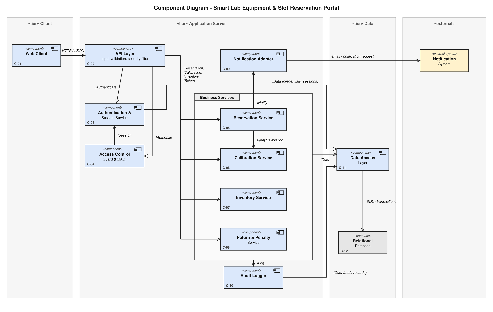
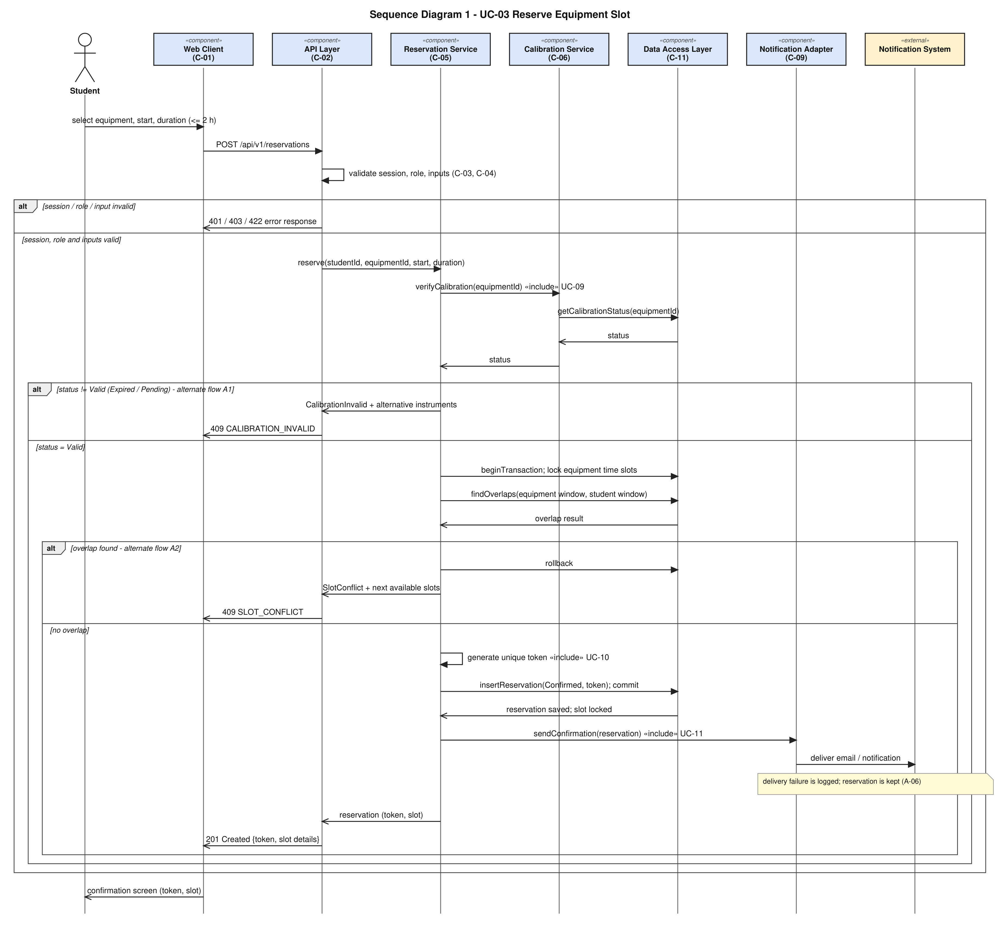
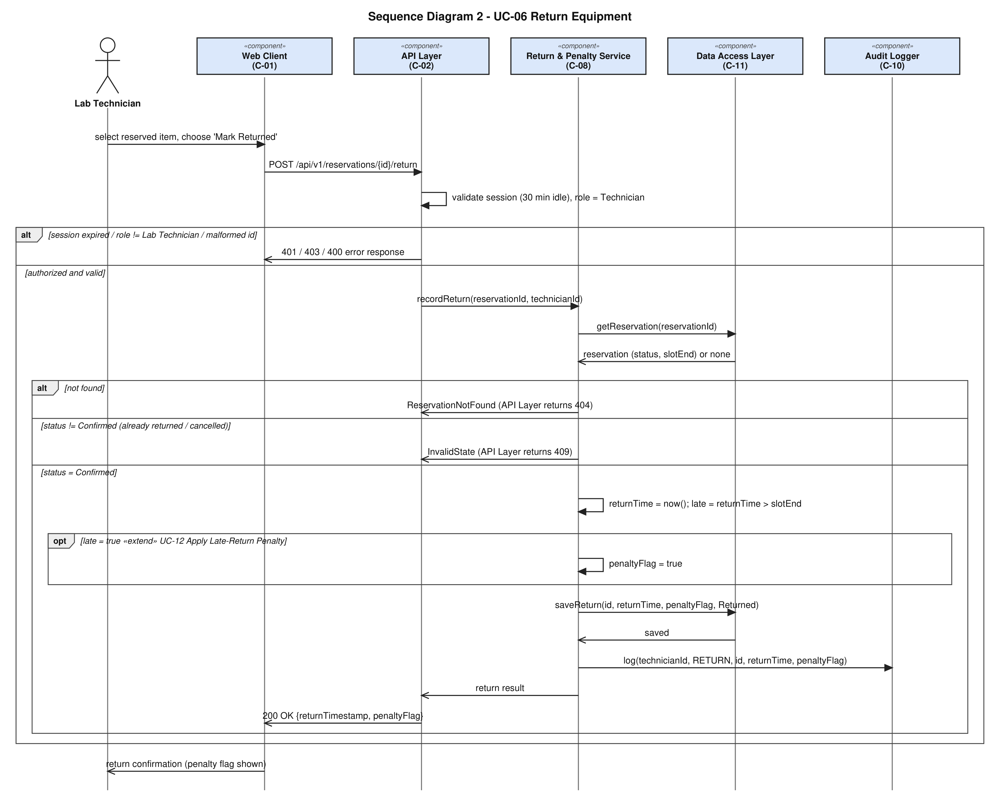

# Software Architecture & Design Specification

**Smart Lab Equipment & Slot Reservation Portal**

| | |
|---|---|
| Document ID | SADS-SLP-01 |
| Version | 1.0 (Mini-Project Part-1) |
| Author | Anagha N (PES1UG24CS058) |
| Format | IEEE Std 1016 (software design description) / ISO/IEC/IEEE 42010 (architecture description) structure |
| Inputs | `SRS.md` (SRS-SLP-01) |
| Part I | Architecture: §1–§7. Part II – Design: §8–§12 |

> **Status.** This is a *design for a system that is not yet implemented*. Technology products are deliberately not named because Lab 1 did not choose any (SRS A-01). Where the SRS is silent, a labelled design decision (DD-xx) is made and listed in §12 for confirmation.

## 1. Introduction

### 1.1 Purpose and scope
Describe the structure of the portal and the detailed design needed to implement SRS-SLP-01: components and their responsibilities, how security requirements are realised, the HTTP API, the interaction of components in two key use cases, and error handling.

### 1.2 References
SRS (`SRS.md`), Test Plan (`Test_Plan.md`), Traceability (`traceability/Requirements_Traceability.md`), Lab 1 documents (see SRS §1.4).

### 1.3 Definitions
IDs follow the SRS: FR/NFR/SEC-REQ/UC. **C-nn** = architecture component, **SD-nn** = sequence diagram, **DD-nn** = design decision.

## Part I – Architecture

## 2. Architectural Drivers

| Driver | Source | Consequence for the architecture |
|---|---|---|
| No double booking, even under simultaneous requests | FR-001, NFR-003 | One authoritative store with transactional locking; all reservation writes in a single locked transaction. |
| Reservation processed in ≤ 200 ms | NFR-001 | Short transaction; no slow external call inside it (DD-04). |
| Role-restricted functions, session expiry | NFR-002, SEC-REQ-01/02 | Central authentication and authorization components that every request passes through. |
| Student-own-data access | SEC-REQ-03 | Ownership checks in the reservation logic. |
| Input validation | SEC-REQ-05 | Single validating entry point (API layer) plus parameterised data access. |
| Accountability | SEC-REQ-06 | Dedicated audit component. |
| External notification, failure-tolerant | FR-009, A-06 | Adapter component isolating the external system. |
| Calibration check as a distinct rule | FR-002, FR-008 | Separate component with one responsibility, reused by reservation. |

## 3. Architecture Pattern

**Selected pattern: layered client–server architecture (three tiers: web client / application server / relational database), with a service-oriented decomposition of the business layer.**

Structure derived from the actual system:
- Users work through a browser portal → a **client tier** (C-01).
- All business rules (calibration, overlap, cut-off, penalty, RBAC) must be enforced centrally and cannot be trusted to the browser (NFR-002, SEC-REQ-05) → an **application-server tier** (C-02…C-10) exposing an HTTP/JSON API.
- NFR-001/NFR-003 explicitly call for *database-level lock isolation*, i.e. a transactional relational store that is the single source of truth → a **data tier** (C-11, C-12).
- Inside the server the layers are: API layer (entry, validation, security filter) → business services (reservation, calibration, inventory, return/penalty) → data access layer. Cross-cutting components (authentication, access control, audit, notification adapter) are separate so that each security requirement maps to one component.

Why not alternatives: *MVC* describes the internal structure of a UI application rather than the system-level split between browser, server and database, so it is not used as the system pattern (the web client may use it internally, which is not constrained here). *Microservices* would add distributed transactions that conflict with the single-transaction locking required by NFR-003, and the scale (one lab) does not justify it. *Event-driven/publish-subscribe* is not needed: the only asynchronous interaction is the one notification request (DD-04).

## 4. Component View

### 4.1 Component diagram



Dashed arrows are UML dependencies (the arrow points to the component that provides the interface). The *Business Services* package groups C-05…C-08; arrows crossing its border apply to the contained services as listed in the table.

### 4.2 Component descriptions

| ID | Component | Responsibility | Provided interface / depends on | Related requirements |
|---|---|---|---|---|
| C-01 | Web Client | Browser UI for all use cases; shows role-specific menus; displays error messages; never enforces rules on its own. | Uses HTTP/JSON API of C-02. | UC-01…UC-08 UI; EIR-01; FR-001, FR-003, FR-007, FR-009 (display) |
| C-02 | API Layer | Single entry point: routes requests, runs the security filter (session present, not expired → C-03; role allowed → C-04), validates inputs, maps component results and exceptions to HTTP responses (§11). | Provides HTTP/JSON API (§9). Uses IAuthenticate (C-03), IAuthorize (C-04), IReservation, ICalibration, IInventory, IReturn. | SEC-REQ-04, SEC-REQ-05, NFR-001 (request handling), EIR-04 |
| C-03 | Authentication & Session Service | Verifies credentials, issues a session token bound to user and role, tracks last activity and expires sessions after 30 min inactivity. | Provides IAuthenticate, ISession. Uses C-11 (credentials, sessions). | FR-006, NFR-002, SEC-REQ-02, SEC-REQ-04 |
| C-04 | Access Control Guard (RBAC) | Decides whether the role in the session may call an operation (technician-only vs student-only). | Provides IAuthorize. Uses ISession (C-03). | NFR-002, SEC-REQ-01, SEC-REQ-03 (role part) |
| C-05 | Reservation Service | Availability query; reserve (duration, horizon, overlap, own-overlap); token generation; cancel (ownership, cut-off, release); own history. Runs the reservation transaction. | Provides IReservation. Uses ICalibration (C-06), INotify (C-09), IData (C-11). | FR-001, FR-003, FR-007, FR-010, NFR-001, NFR-003, SEC-REQ-03; UC-02…UC-05, UC-10 |
| C-06 | Calibration Service | Verifies calibration status (UC-09) and updates it (UC-07). | Provides ICalibration. Uses IData, ILog. | FR-002, FR-008, SEC-REQ-06 |
| C-07 | Inventory Service | Add / update / remove equipment records; refuses removal with future Confirmed reservations (DD-06). | Provides IInventory. Uses IData, ILog. | FR-005, SEC-REQ-05, SEC-REQ-06 |
| C-08 | Return & Penalty Service | Records returns, computes the late-return flag (UC-12). | Provides IReturn. Uses IData, ILog. | FR-004, SEC-REQ-06 |
| C-09 | Notification Adapter | Builds and submits the confirmation request to the external Notification System; logs failures without failing the reservation. | Provides INotify. Uses the Notification System. | FR-009, EIR-02, A-06 |
| C-10 | Audit Logger | Writes audit records for privileged actions; also receives error log entries (§11.4). | Provides ILog. Uses IData (audit records). | SEC-REQ-06, SEC-OBJ-04 |
| C-11 | Data Access Layer | All persistence; transactions and slot/row locks; parameterised statements only. | Provides IData. Uses C-12 over SQL. | NFR-001, NFR-003, SEC-REQ-05, EIR-03 |
| C-12 | Relational Database | Stores users, sessions, equipment, reservations, audit records; provides transactions and locking. | SQL. | NFR-003, EIR-03 |
| EXT | Notification System (external) | Delivers email / notification. Not part of the system. | Used by C-09. | FR-009 |

Every component has at least one related requirement; no requirement is without a component (§5).

## 5. Traceability: Requirements → Use Cases → Components → Design

| Requirement | Use case | Components | Design elements | Tests |
|---|---|---|---|---|
| FR-001 | UC-02, UC-03, UC-10 | C-01, C-02, C-05, C-11, C-12 | SD-01; API `GET /equipment/{id}/availability`, `POST /reservations`; DD-01, DD-02 | TC-01–04, 17, 21 |
| FR-002 | UC-03, UC-09 | C-05, C-06, C-11 | SD-01 (alt A1); `409 CALIBRATION_INVALID` | TC-01, 05, 13 |
| FR-003 | UC-04 | C-05, C-11 | API `POST /reservations/{id}/cancel`; DD-05 | TC-06, 07, 23 |
| FR-004 | UC-06, UC-12 | C-08, C-10, C-11 | SD-02; API `POST /reservations/{id}/return` | TC-08, 09, 22 |
| FR-005 | UC-08 | C-07, C-10, C-11 | API `POST/PUT/DELETE /equipment`; DD-06 | TC-10, 21, 22 |
| FR-006 | UC-01 | C-03, C-11 | API `POST /auth/login` | TC-11, 19, 20 |
| FR-007 | UC-05 | C-05, C-11 | API `GET /reservations/me` | TC-12 |
| FR-008 | UC-07 | C-06, C-10, C-11 | API `PUT /equipment/{id}/calibration` | TC-13, 22 |
| FR-009 | UC-11 | C-05, C-09 | SD-01; DD-04 | TC-14 |
| FR-010 | UC-03 | C-05, C-11 | SD-01 (overlap check, both windows) | TC-15 |
| NFR-001 | UC-03 | C-02, C-05, C-11 | DD-02, DD-04 | TC-16 |
| NFR-002 | UC-06/07/08 | C-03, C-04, C-02 | SD-02 (security filter); §7 | TC-18, 19 |
| NFR-003 | UC-03 | C-05, C-11, C-12 | DD-02; SD-01 | TC-17 |
| SEC-REQ-01…06 | – | see §7 | see §7 | TC-11, 12, 18–23 |

## 6. Data View

Logical entities (technology-neutral):

| Entity | Attributes | Notes |
|---|---|---|
| User | id, username, role (Student / Lab Technician), credential verifier | Credential verifier is not a plain-text password (SEC-REQ-04); algorithm is an implementation choice. |
| Session | token, userId, role, lastActivity | Valid while now − lastActivity ≤ 30 min (SEC-REQ-02). |
| Equipment | id, name, category, calibrationStatus (Valid / Expired / Pending), calibrationDueDate | FR-005, FR-008, A-02. |
| Reservation | id, studentId, equipmentId, slotStart, slotEnd, status (Confirmed / Cancelled / Returned), token (unique), createdAt, returnTimestamp, penaltyFlag | FR-001, 003, 004. |
| AuditRecord | id, userId, role, action, targetId, timestamp | SEC-REQ-06. |

Relationships: a User (Student) has many Reservations; Equipment has many Reservations. Constraint: the database shall not allow two Confirmed reservations of the same equipment with overlapping slots (enforced by the locked transaction of DD-02; a database-level exclusion/uniqueness rule can be added as defence in depth if the chosen database supports it).

## 7. Security Architecture

### 7.1 Trust boundaries
Browser (untrusted) → API Layer (first trusted point: security filter and validation) → services → data. The Notification System is outside the boundary and receives only the confirmation data of FR-009. Nothing the browser sends (role, student id, times) is trusted: role and user id come from the server-side session, never from the request body.

### 7.2 Security requirement → control → mechanism → validation

| Security objective | Requirement | Component(s) / control | Design mechanism | Validation |
|---|---|---|---|---|
| SEC-OBJ-01 | SEC-REQ-01 | C-04 Access Control Guard, invoked by C-02 for every operation | Static operation → allowed-roles table; technician-only: calibration, inventory, return, list-all-reservations; deny by default; 403 `FORBIDDEN_ROLE`. | TC-18 |
| SEC-OBJ-01 | SEC-REQ-02 | C-03 | `lastActivity` updated on every valid request; request rejected if now − lastActivity > 30 min; 401 `SESSION_EXPIRED`. | TC-19 |
| SEC-OBJ-01 | SEC-REQ-04 | C-03, C-02 security filter | Every endpoint except `POST /auth/login` requires a valid session token; login returns one generic error for unknown user and wrong password; credentials stored only as a verifier and excluded from logs (C-10 / §11.4). | TC-11, TC-20 |
| SEC-OBJ-03 | SEC-REQ-03 | C-05 (+ C-04 for role) | Ownership check `reservation.studentId == session.userId` before read or cancel; 403 `FORBIDDEN_RESOURCE` with no reservation data in the body. History query is filtered by the session's user id, not by a client-supplied id. | TC-12, TC-23 |
| SEC-OBJ-02 | SEC-REQ-05 | C-02 input validation; C-11 | Schema validation (type, format, range) before any service call; parameterised statements only in C-11; server-side horizon / duration rules. | TC-21 |
| SEC-OBJ-04 | SEC-REQ-06 | C-10 | Services C-06, C-07, C-08 call `ILog` after a successful privileged action, recording user id, role, action, target, time (same transaction as the change, DD-07). | TC-22 |
| SEC-OBJ-02 | NFR-003 (integrity) | C-05, C-11, C-12 | Locked transaction for reservation writes. | TC-17 |

Deployment assumption A-10 (HTTPS) protects session tokens in transit; it is a configuration dependency, not a component.

## Part II – Design

## 8. Design Decisions

| ID | Decision | Rationale / requirement | Needs confirmation? |
|---|---|---|---|
| DD-01 | A Reservation Token is a random, non-guessable identifier generated server-side and stored with a uniqueness constraint; it is bound to the reservation row (student, equipment, slot). Exact format/length is an implementation choice. | FR-001 "unique token bound to student, equipment, slot"; UC-10. | Format only |
| DD-02 | The reservation write is a single database transaction: lock the student row and then the equipment row (fixed order, avoids deadlock) → re-read calibration status → check overlap for equipment window and student window → insert → commit. Concurrent requests for the same equipment are serialised by the lock. | NFR-003, NFR-001, FR-010 | No |
| DD-03 | Times are compared in one server time base; the slot window is `[slotStart, slotEnd)`, so back-to-back slots do not overlap. | FR-001, TC-04 | Yes (A-05) |
| DD-04 | The request to the Notification System is submitted after the transaction commits and a failure never rolls back the reservation; it is logged. | A-06, NFR-001 (no external call inside the timed path or the lock) | Yes (A-06) |
| DD-05 | Cancel: allowed when `now ≤ slotStart − 60 min`; sets status Cancelled; the slot is free immediately on commit (well inside the 5 s of FR-003). | FR-003, A-04 | Yes (A-04) |
| DD-06 | Removing equipment with future Confirmed reservations is rejected (409 `EQUIPMENT_HAS_ACTIVE_RESERVATIONS`). | FR-005, A-07 | Yes (A-07) |
| DD-07 | Audit records are written in the same transaction as the privileged change, so a change without audit record cannot be committed. | SEC-REQ-06 | No |
| DD-08 | Role and user id are taken from the server-side session, never from request parameters. | SEC-REQ-01/03 | No |

## 9. API Design

The portal exposes an HTTP/JSON API consumed by its own web client (C-01). Base path `/api/v1`. Content type `application/json`. All endpoints except `POST /auth/login` require header `Authorization: Bearer <session token>` (SEC-REQ-04). Timestamps are ISO-8601. Role column: S = Student, T = Lab Technician.

### 9.1 Endpoint catalogue

| # | Method & path | Purpose | Role | Use case | Requirement |
|---|---|---|---|---|---|
| 1 | `POST /auth/login` | Authenticate, create session | public | UC-01 | FR-006 |
| 2 | `GET /equipment?category=&calibrationStatus=` | List equipment with calibration status | S, T | UC-02 | FR-001 |
| 3 | `GET /equipment/{id}/availability?from=&to=` | Reserved / free slots of one item | S, T | UC-02 | FR-001 |
| 4 | `POST /equipment` | Add equipment | T | UC-08 | FR-005 |
| 5 | `PUT /equipment/{id}` | Update equipment | T | UC-08 | FR-005 |
| 6 | `DELETE /equipment/{id}` | Remove equipment | T | UC-08 | FR-005 |
| 7 | `PUT /equipment/{id}/calibration` | Set calibration status | T | UC-07 | FR-008 |
| 8 | `POST /reservations` | Reserve a slot | S | UC-03 | FR-001, 002, 009, 010 |
| 9 | `GET /reservations/me` | Own reservation history | S | UC-05 | FR-007 |
| 10 | `GET /reservations/{id}` | One reservation (owner or technician) | S (owner), T | UC-05 | FR-007, SEC-REQ-03 |
| 11 | `POST /reservations/{id}/cancel` | Cancel own reservation | S (owner) | UC-04 | FR-003 |
| 12 | `GET /reservations?status=Confirmed` | List reservations to process returns | T | UC-06 | FR-004 |
| 13 | `POST /reservations/{id}/return` | Record return, set penalty flag | T | UC-06, UC-12 | FR-004 |

No other API exists; endpoint 12 is a design addition so that a technician can select "the reserved item" of UC-06.

### 9.2 Details of the main endpoints

**1. `POST /auth/login`** – Request `{ "username": "string", "password": "string" }`. Success `200 { "token": "…", "role": "Student|Lab Technician", "expiresAfterIdleMinutes": 30 }`. Errors: `400 VALIDATION_ERROR` (missing field), `401 INVALID_CREDENTIALS` (same body for unknown user and wrong password). Not authenticated by design.

**2. `GET /equipment`** – Success `200 { "items": [ { "id": 1, "name": "…", "category": "…", "calibrationStatus": "Valid", "calibrationDueDate": "2026-12-31" } ] }`. Errors: 401, 400 (unknown filter value).

**3. `GET /equipment/{id}/availability`** – Success `200 { "equipmentId": 1, "reserved": [ {"start": "…", "end": "…"} ] }`. Errors: 401, 404 `EQUIPMENT_NOT_FOUND`, 400.

**4–6. Equipment maintenance (T)** – `POST /equipment` body `{ "name", "category", "calibrationDueDate" }` → `201` with the record; `PUT /equipment/{id}` same body → `200`; `DELETE /equipment/{id}` → `200`. Errors: 401, 403 `FORBIDDEN_ROLE`, 404, 422/400 validation, 409 `EQUIPMENT_HAS_ACTIVE_RESERVATIONS` (delete only).

**7. `PUT /equipment/{id}/calibration`** – Request `{ "status": "Valid|Expired|Pending" }` → `200` updated record. Errors: 401, 403, 404, `422 INVALID_CALIBRATION_STATUS`.

**8. `POST /reservations`** – Request `{ "equipmentId": 1, "start": "2026-10-02T10:00:00", "durationMinutes": 90 }`. Student id comes from the session (DD-08). Success `201 { "reservationId": 17, "token": "…", "equipmentId": 1, "start": "…", "end": "…", "status": "Confirmed" }`. Errors:

| HTTP | Code | Condition |
|---|---|---|
| 400 | `VALIDATION_ERROR` | missing / non-numeric / malformed field |
| 422 | `DURATION_EXCEEDS_LIMIT` | duration > 120 min (or ≤ 0 → `VALIDATION_ERROR`) |
| 422 | `START_OUT_OF_RANGE` | start in the past or later than now + 7 days |
| 401 / 403 | `AUTHENTICATION_REQUIRED`, `SESSION_EXPIRED`, `FORBIDDEN_ROLE` | filter |
| 404 | `EQUIPMENT_NOT_FOUND` | unknown equipment |
| 409 | `CALIBRATION_INVALID` | status Expired / Pending; body carries the FR-002 message and `alternatives` |
| 409 | `SLOT_CONFLICT` | overlap on equipment; body carries `nextAvailableSlots` |
| 409 | `STUDENT_SLOT_CONFLICT` | student has an overlapping reservation (FR-010) |

**9. `GET /reservations/me`** – Success `200 { "items": [ { "id", "equipment", "start", "end", "status", "token", "penaltyFlag" } ] }` (only the caller's records). Errors: 401, 403.

**10. `GET /reservations/{id}`** – Success `200` one item. Errors: 401, 403 `FORBIDDEN_RESOURCE` (student, not owner), 404 `RESERVATION_NOT_FOUND`.

**11. `POST /reservations/{id}/cancel`** – No body. Success `200 { "reservationId", "status": "Cancelled" }`. Errors: 401, 403 `FORBIDDEN_RESOURCE`, 404, `409 CANCELLATION_WINDOW_CLOSED` (less than 60 min to start), `409 INVALID_RESERVATION_STATE` (already Cancelled / Returned).

**12. `GET /reservations?status=Confirmed`** – Success `200` list (all students) for technicians. Errors: 401, 403.

**13. `POST /reservations/{id}/return`** – No body; technician id from the session. Success `200 { "reservationId", "status": "Returned", "returnTimestamp": "…", "penaltyFlag": true|false }`. Errors: 401, 403 `FORBIDDEN_ROLE`, 400 (malformed id), 404 `RESERVATION_NOT_FOUND`, 409 `INVALID_RESERVATION_STATE`.

### 9.3 Common error body
```
{ "error": { "code": "SLOT_CONFLICT", "message": "Human-readable text", "details": { } } }
```
`message` is safe to show to the user; `details` carries structured data (alternatives, next slots, field errors). No stack traces or internal identifiers are returned.

## 10. Sequence Diagrams

The two sequence diagrams model use cases UC-03 (the core use case specified in Lab 1) and UC-06 (the technician-side use case that exercises RBAC, the extend relationship and auditing).

### 10.1 SD-01 – UC-03 Reserve Equipment Slot



Covers: FR-001, FR-002, FR-009, FR-010, NFR-001, NFR-003; alternate flows A1 (calibration), A2 (conflict), A3 (invalid session/input); the «include» use cases UC-09, UC-10, UC-11. Steps 4–5 of the Lab 1 flow (calibration, overlap) appear in the same order. The overlap check and the insert happen inside one locked transaction (DD-02). The request to the Notification System is submitted after commit (DD-04).

### 10.2 SD-02 – UC-06 Return Equipment



Covers: FR-004, NFR-002, SEC-REQ-01, SEC-REQ-02, SEC-REQ-06; the «extend» use case UC-12 appears as the `opt` fragment taken only when `returnTime > slotEnd`. The security filter rejects expired sessions (401) and non-technician roles (403) before the service is called.

## 11. Error Handling

### 11.1 Principles
1. Validate early (API Layer) and fail with a precise code; never let invalid input reach the data layer (SEC-REQ-05).
2. A failed request changes no data: reservation, cancellation, return and inventory operations run in one transaction that is rolled back on any failure (FR-001 postcondition "no reservation record is created").
3. Messages for users are specific enough to act on but never reveal internals, other users' data, or whether a username exists.
4. The same error body format is used everywhere (§9.3).

### 11.2 Error categories

| Category | Examples | HTTP | User-facing behaviour | System behaviour |
|---|---|---|---|---|
| Invalid input | non-numeric id, duration ≤ 0, missing field, bad status value | 400 / 422 | Field-level message; form stays filled | No state change; logged at INFO with request id |
| Business-rule violation | duration > 120, start > 7 d, overlap, student overlap, cancel inside cut-off, invalid state | 422 / 409 | Message from SRS (e.g. FR-002 wording); alternatives or next slots shown | Transaction rolled back; INFO log |
| Calibration not valid | Expired / Pending | 409 `CALIBRATION_INVALID` | "This equipment is currently unavailable for booking — calibration required." + alternative instruments | No reservation created |
| Missing data | unknown equipment or reservation id; no alternatives available | 404 or empty list | "Not found" message; empty-list message in UI | None |
| Authentication failure | no / malformed token, expired session, wrong credentials | 401 | Redirect to login; generic "invalid credentials" text | Log with source and time; never log the password |
| Authorization failure | Student calls technician function; access to another student's reservation | 403 | "You are not allowed to perform this action." | Log WARN (user id, endpoint); no data changed or disclosed |
| Resource unavailable | database down or lock wait too long | 503 `SERVICE_UNAVAILABLE` | "Service temporarily unavailable, please retry." | Transaction rolled back; ERROR log; no partial reservation. (Lock-wait limit is an implementation setting, not specified by the SRS.) |
| External system failure | Notification System unreachable | none (request succeeds) | Reservation confirmed; on-screen confirmation still shown | Failure logged by C-09; reservation kept (A-06). No retry policy is specified. |
| Unexpected error | unhandled exception | 500 `INTERNAL_ERROR` | Generic message with a request id | Transaction rolled back; ERROR log with stack trace (server side only) |

### 11.3 Concurrency errors
When two requests compete for a slot, the one that loses the lock re-checks and receives `409 SLOT_CONFLICT` – not a 500 (TC-17).

### 11.4 Logging strategy
- **Audit log (C-10):** privileged successful actions (SEC-REQ-06). Persistent, in the database.
- **Application log:** timestamp, request id, user id (if any), endpoint, outcome / error code. Never contains passwords, tokens or full request bodies.
- Authentication failures and authorization failures are logged; log retention and rotation are not specified by Lab 1.

## 12. Open Issues and Items Needing Confirmation

| ID | Item | Where used |
|---|---|---|
| A-02 | Calibration status is a stored field; due date does not auto-expire it. | FR-002, FR-008, DD |
| A-03 | Peak load for NFR-001 (20 concurrent requests used for testing only). | TC-16 |
| A-04, A-05 | Cancel cut-off inclusive; whole-minute slots, no minimum duration. | DD-03, DD-05 |
| A-06 | Notification failure keeps the reservation. | DD-04, TC-14 |
| A-07 | Equipment with future reservations cannot be removed. | DD-06 |
| A-10 | HTTPS in deployment; password-verifier algorithm not chosen. | §7 |
| – | Technology stack, hosting, and Notification System protocol not chosen. | whole document |
